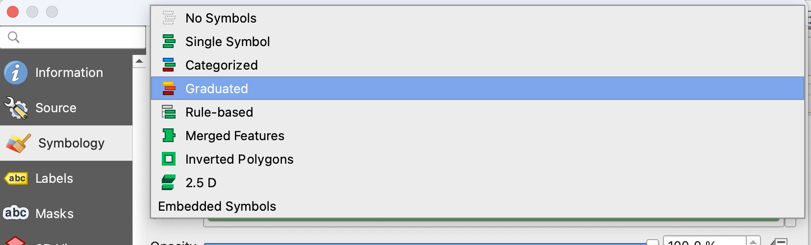
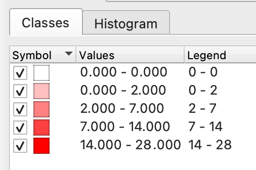
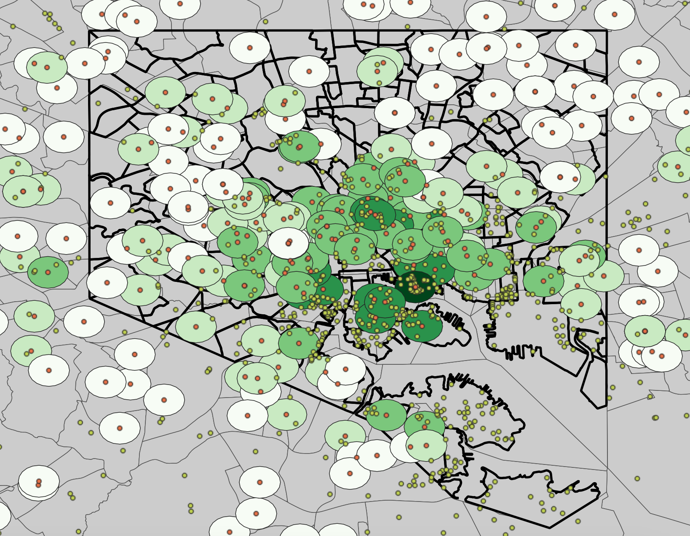

# Bringing it all together
So you've got about five thousand layers now, 80% of which are scratch files, and you're losing track of your naming system. (OMG so relatable.) Now what?

Let's bring these concepts and ideas of **cohesion**, **collaboration** and **replication** together. 

But first, let's make a map. Because that's what this is all about! 

## Choroplething it up
Anyway. For the purposes of this demo, we're going to keep everything in QGIS, assuming that for now the humble screenshot will be sufficient for sharing (and we'll explain in a second why, and what else you can do).

Let's grab our data from `school-sites-count` and open up the **Symbology** menu, which you can access by double clicking the layer and navigating down to `Symbology`, which has a little brush ~~that I always thought was a broom~~ and yellow, blue and red.

At the top, we'll change the drop-down option to **Graduated**, which will let us use a color ramp to show the values collected by Count. Select `NUMPOINTS` as the value, and choose the least visually offensive color ramp of your choice.

Under the "classes" tab, we'll change the **mode** to `Natural Breaks (Jenks)` and set classes by hitting **Classify**. You should get five classes, breaking in these groups:

Then hit **Ok**. 

I'm going to tweak some other symbology elements, like changing the color of some of my layers and toggling off some that had been left on by default. 

Then, because the state of Maryland is kind of huge, I'm going to zoom into Baltimore and look at our results.

Okay, not too bad! We can see that most of the sites are clustered in and around downtown Baltimore, with some other pockets here and there.

Let's keep this in mind with the fact that we have demographic information attached to our original `bmore-neighborhoods` file (remember that one??). Using the same approach as before, we can classify the demographic info and generate another layer of shading to highlight where non-white people, the group typically most impacted by proximity to pollutants and contaminants, live.

