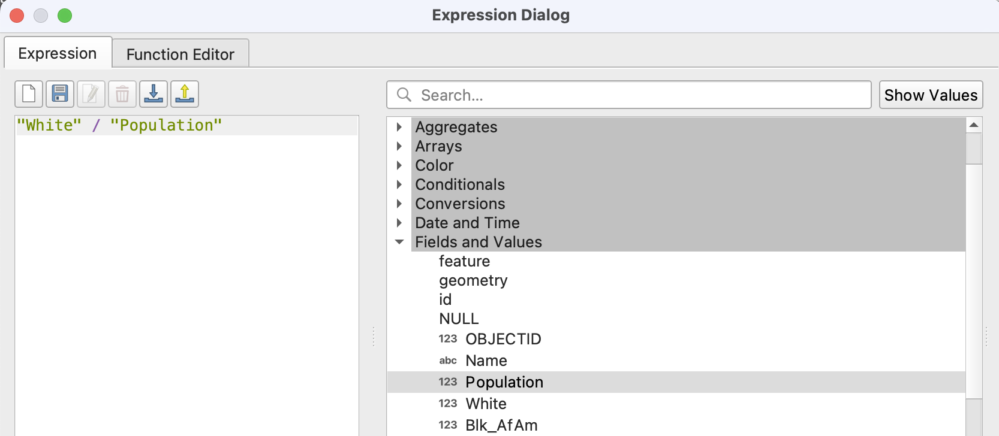
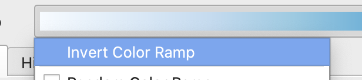
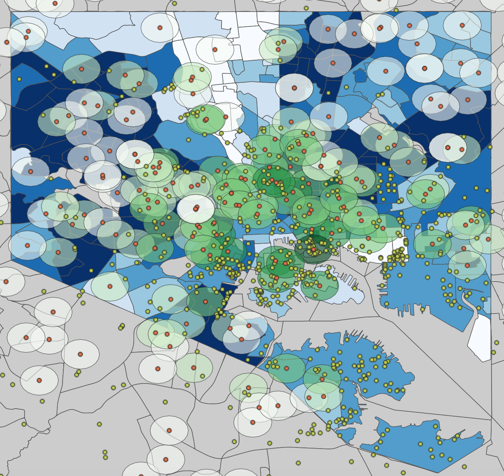
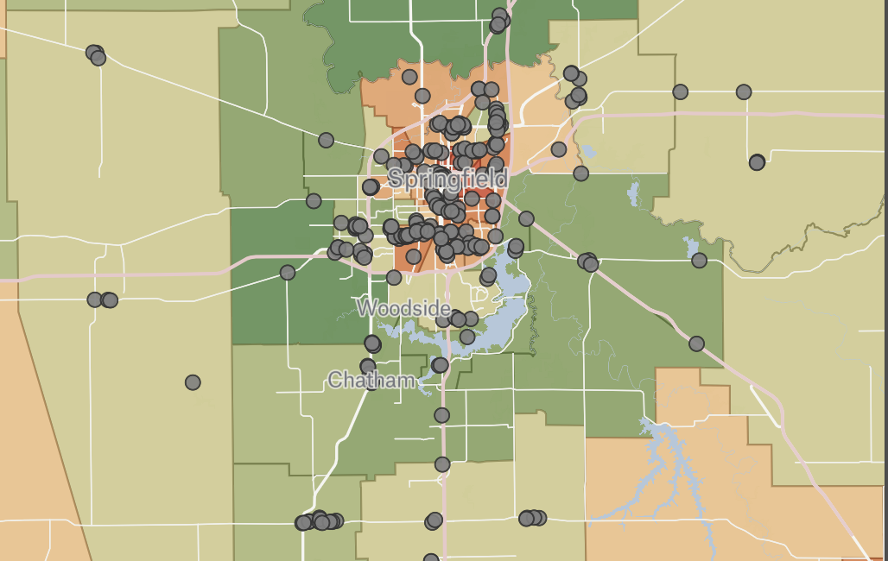
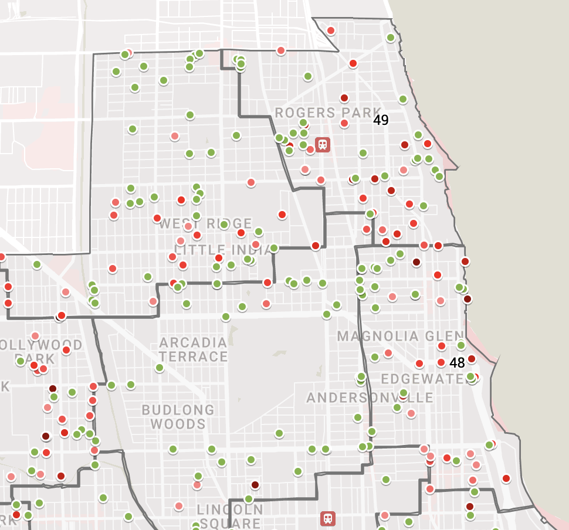
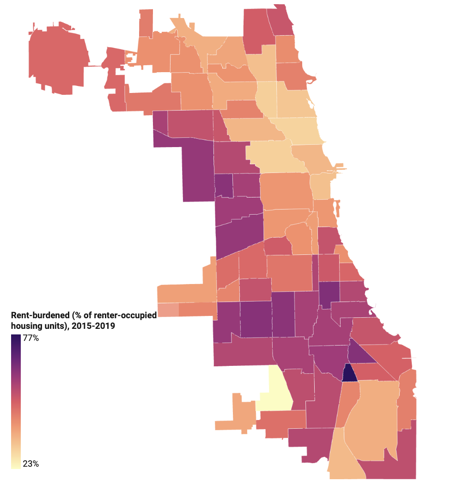

# Bringing it all together
So you've got about five thousand layers now, 80% of which are scratch files, and you're losing track of your naming system. (OMG so relatable.) Now what?

Let's bring these concepts and ideas of **cohesion**, **collaboration** and **replication** together. 

But first, let's make a map. Because that's what this is all about! 

## Choroplething it up
Anyway. For the purposes of this demo, we're going to keep everything in QGIS, assuming that for now the humble screenshot will be sufficient for sharing (and we'll explain in a second why, and what else you can do).

Let's grab our data from `school-sites-count` and open up the **Symbology** menu, which you can access by double clicking the layer and navigating down to `Symbology`, which has a little brush ~~that I always thought was a broom~~ and yellow, blue and red.

At the top, we'll change the drop-down option to **Graduated**, which will let us use a color ramp to show the values collected by Count. Select `NUMPOINTS` as the value, and choose the least visually offensive color ramp of your choice.

Under the "classes" tab, we'll change the **mode** to `Natural Breaks (Jenks)` and set classes by hitting **Classify**. You should get five classes, breaking in these groups:

Then hit **Ok**. 

I'm going to tweak some other symbology elements, like changing the color of some of my layers and toggling off some that had been left on by default. 

Then, because the state of Maryland is kind of huge, I'm going to zoom into Baltimore and look at our results.

Okay! We can see that most of the schools that carry the largest burden (ie, have the most sites within that half mile radius) are clustered in and around downtown Baltimore, with some other pockets here and there.

Let's keep this in mind with the fact that we have demographic information attached to our original `bmore-neighborhoods` file (remember that one??). Using the same approach as before, we can classify the demographic info and generate another layer of shading to highlight where non-white people, the group typically most impacted by proximity to pollutants and contaminants, live.

I'm going to re-open Symbology for `bmore-neighborhoods` and select this lil' guy next to the value bar. This opens up an expressions box that can let us create a calculated field in a snap!

In this data, `White` represents white-alone respondents, and I want it as the value for a graduated symbology. The problem is that we can't just bank on raw numbers here, and the data has to be normalized against the population in order to get a sense of proportion. So in this case, what we'll do is divide `White` (the population of white-alone respondents) with the total `Population` (the entire population), to get the percentage of white-alone people per neighborhood.

At the bottom of that blank text/expression box, there should be a preview of the expected value based on a drop-down. In this case, it's a decimal percentage!

Then hit **Okay** and return back to the Symbology window. For the sake of consistency, I'm going to go with **Natural Breaks (Jenks)** again for our classification, so hit **Classify** at the bottom to get the decimal values to pop up.

I'm picking a color ramp that should have enough contrast to not be a nightmare, and I'm going to **invert the ramp** to get a rough estimate of people who did not identify themselves as only white in the Census. 

This way, the darkest shade of this color ramp will represent the smallest share of respondents to white-alone, roughly mapping out to the largest share of non-white (and non-white-alone) people.

## Bringing in reporters and making it a collaboration

Play around with the classes until patterns start to emerge; I think this is where local knowledge, and pairing up with a reporter who has done some research and digging or is on the ground, can help bolster preliminary data findings. 

In this case, it looks like there might be some patterns emerging, but I don't live in Maryland, and this is my first time ever in Baltimore!

As reporters, the relationship and dynamic in the newsroom is one that can be inherently collaborative if we open ourselves up to it. One way that I like to do this in my newsroom is by pulling partners in to gut-check and bounce ideas off each other once I have some things to look at.

While the humble, wonderful screenshot is great, it might be best to pull it into a more interactive format. 

Web mapping has come a long way, and it's often very accessible for non-technical reporters to understand and play with! In a QGIS setting, I'll use a variety of approaches:

### Exporting to Felt
Not too long ago, the folks at Felt launched a [plugin](https://plugins.qgis.org/planet/tag/felt/) that [allows for direct import of layers into their platform](https://felt.com/blog/qgis-maps-on-the-web-with-felt), which can make sharing maps with reporters a breeze. 

Outside of this demo, I've used this pipeline to allow reporters to toggle between layers and see more precise results, like this map that showed median household income and video gaming establishments in Springfield, Illinois:

Right now Felt is a freemium tool, so I'm often using it to quickly host maps that I can later delete to save space.

### Exporting to Google MyMaps
Google Maps is another very familiar resource for reporters to poke around at data. In order to export what you have in front of you into MyMaps, right click the desired layer, hit `Save Features As`, and select **KML**. 

I've done this to quickly share Chicago 311 data with reporters, like this map of pothole complaints and response times (green = average, shaded red for how far away from the average it is) with reporters:

MyMaps isn't without limitations, though — it has a maximum limit of 2000 points/rows, and files have to be within a certain size.

### Exporting to Datawrapper
Ahhhhhh Datawrapper. I've used this incredibly nimble and flexible tool to make maps of all kinds at all stages for reporters throughout the process, pulling them in so they have necessary context in a way that makes sense. 

In this case, I used it in my student newsroom to quickly show people what areas of the city of Chicago are most rent-burdened:

