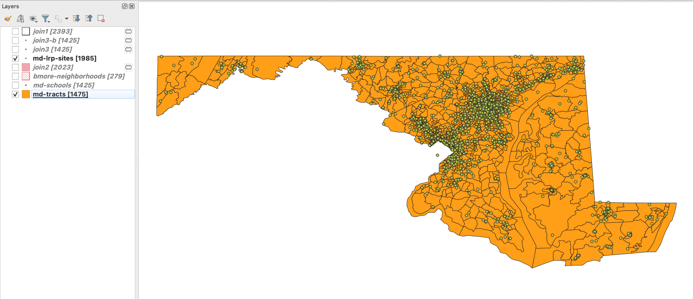
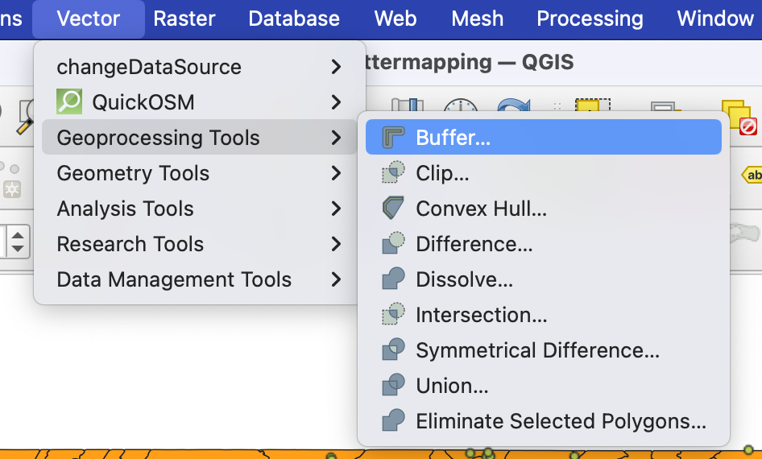
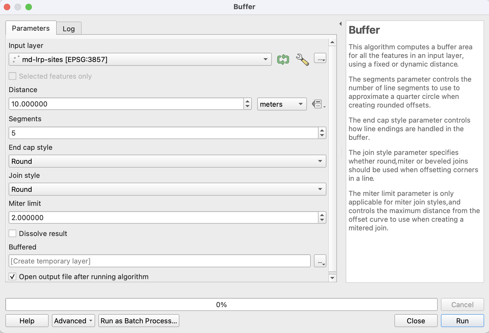
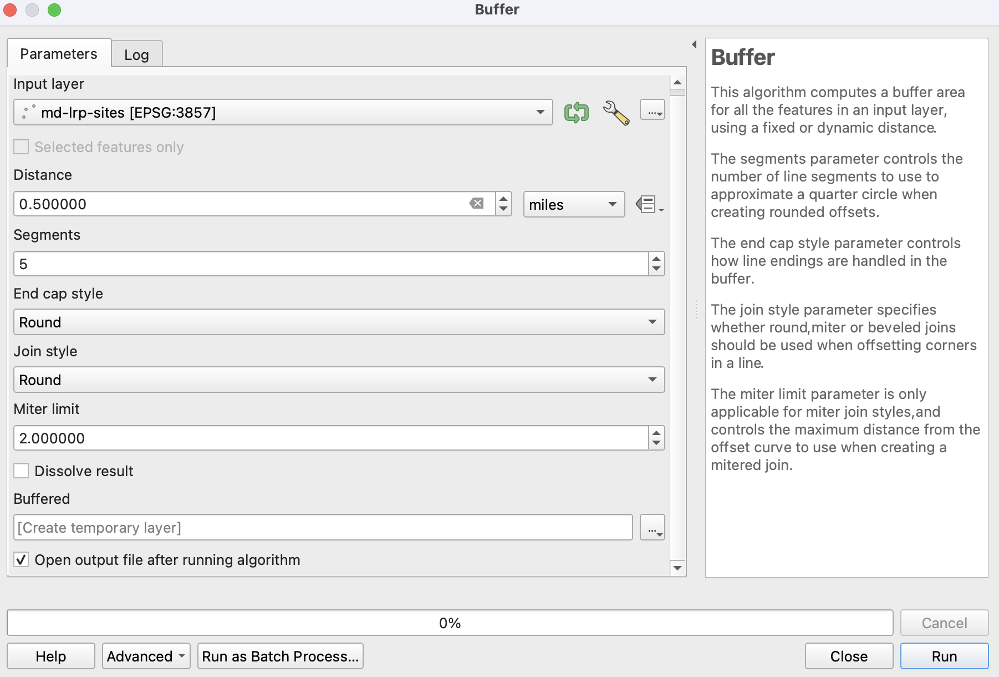
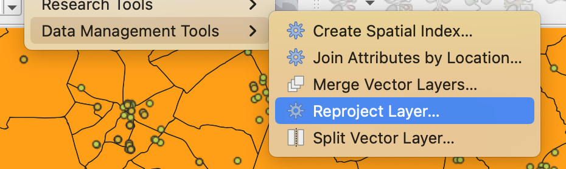
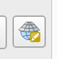
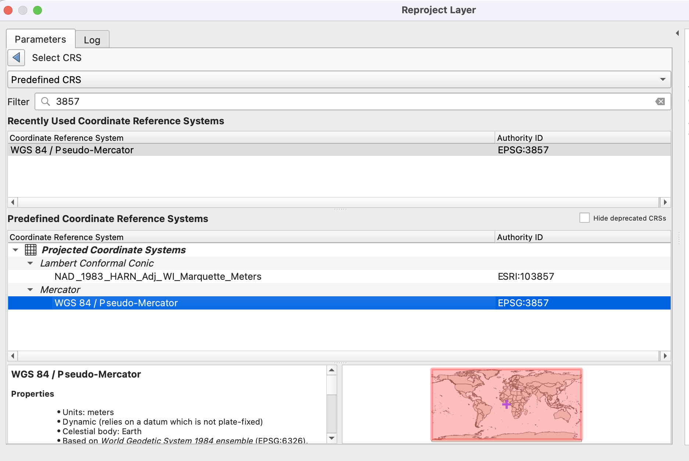
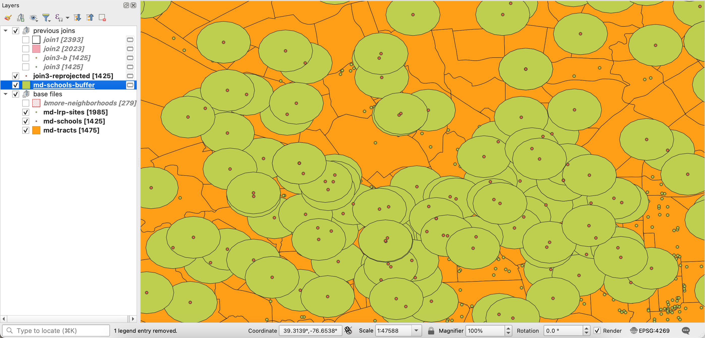
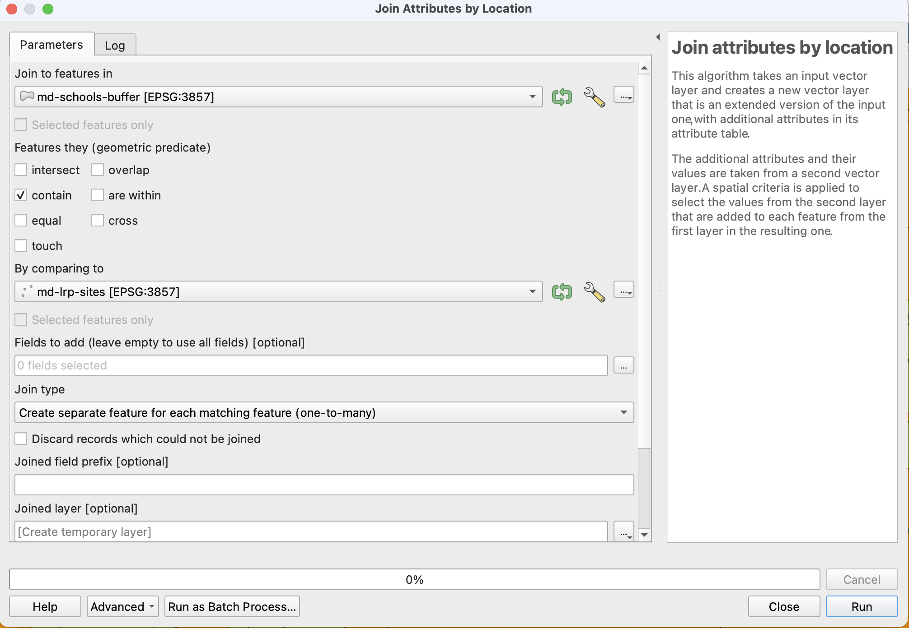
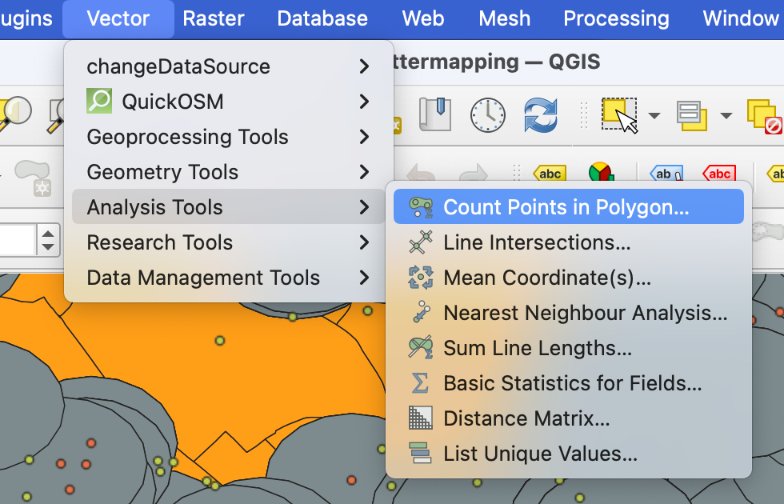

# Building buffers and clustering(-ish) in QGIS

Let's build off our `join3-b` dataset from the [last walkthrough](./qgis-spatial-joins.md) and see what patterns and stories we can start to build out of the data!

For this walkthrough, we have our dataset of Maryland schools joined against Census tracts and Baltimore's neighborhoods, which is great. But let's add one more file into the mix: `md-lrp-sites`: a point-type shapefile of [hazardous waste sites in the state of Maryland](https://mde.maryland.gov/programs/land/marylandbrownfieldvcp/pages/index.aspx), including both state- and federal-level priorities. 

We'll load `md-lrp-sites` into QGIS [like before](./qgis-walkthrough.md), importing it through the `Layer` > `Add Layer` > `Vector Data` toolbar and accepting any necessary and recommended reprojections.

Because `md-lrp-sites` is also a shapefile, we'll take the extra step to add a **spatial index** to speed up processing, and also toggle on the feature count and rename the layer to match the file name. (Stuck? Look at the [basics walkthrough!](./qgis-walkthrough.md)) This should leave us with a layer that has 1985 features.

## Navigating the buffer tool

We're still going to be working under the Vector toolbar, but a different menu option this time: **Geoprocessing Tools**. Navigate over to `Vector` > `Geoprocessing Tools` > `Buffer...` to open up the **Buffer menu** window.

Once you open it, you'll be met with this window:

This tool, as described on the side, adds on a layer surrounding any feature in the input layer with a buffer following certain parameters. In this case, we're going to create a radius around different school locations, based on [a study from the EPA promoted in 2023](https://cfpub.epa.gov/si/si_public_record_report.cfm?dirEntryId=360055&Lab=CPHEA&subject=Health%20Research&showcriteria=0&searchall=Environmental%20Justice&sortby=revisionDate), which used a **half-mile radius** to look at K-12 school proximity to polluters and hazardous waste/material sites. 

We'll change the input layer to `join3-b`, so we have the joined data and demographics on each school, set the distance input to `0.5`, and the unit drop-down to `miles`, like so:

Once everything is set, hit **Run**. A new scratch layer will be added to the map render, showing a half-mile radius around each school. (See, I told you it would be quick!)

 *If you're running this, you may run up against an error message not allowing you to change the distance input to any unit other than **degrees**. In order to fix it, we'll reproject the layer to a projected local coordinate system like this*:
> > 1. With the layer `join3-b` highlighted, navigate to the `Vector` toolbar, then to `Data Management Tools` and the `Reproject Layer...` menu option.
>>
>> 
>>
>> 2. It looks like our CRS for the `join3-b` layer is **NAD83**, and we need to get it in a different format that supports a special kind of map math that generates buffers. We're going to select this little guy in the **reproject layer** window to select a new CRS that fits within a **projected local coordinate system** instead of a **geographic coordinate system**.
>>
>> 
>>
>> 3. In the filter bar, enter `3857`. This will take us to the Mercator projected coordinate system `WGS 84 / Pseudo-Mercator` which is, you guessed it, `EPSG:3857`. Hit run to reproject; you'll get a scratch layer named **`Reprojected`**. Rename it to "`md-schools-reprojected-joined`".
>>
>>
>>
>>***Bonus!*** 4. Be grateful that in this moment, you make the medium bucks, and not the big bucks, because otherwise you'd be expected to understand every element of the map math you just did. But that's above your paygrade! Good job. :) 

Phew, let's run that again. Take `md-schools-reprojected-joined` and run it through the **Buffer** tool above to get a solid, 0.5-mile buffer around each one of Maryland's schools.

Wow, look at all of those buffers! And that insane color scheme. In this case, I renamed the buffer layer to **`md-schools-buffer`**, and you can see the green circles are centered on each school location.

But now what? Let's use this to tell a story.

## Combining spatial joins and buffers
Just like in the [previous walkthrough](./qgis-spatial-joins.md), we're going to use the **Join Attributes by Location** tool to see what hazardous waste sites are within that 0.5 mile buffer zone to each school. 

We'll still "group" the join by school, and we'll do a **one-to-many** join to encompass the reality that not only could multiple sites belong to one school, but that one site may also be within the buffer zones of multiple schools. 

(Remember: we can always export this file out to a .csv and use a tool like pivot tables to group and drill things down anyway! I view QGIS as a tool to do all — okay, most of — the crunching, and Excel/sheets to do all the refining.)

Create a spatial index first, then when you run the join, you'll be left with a `Joined` layer. We'll rename this to **`schools-buffer-join`**. It should have 1874 features.

## More map math: clustering, sort of.
One thing that QGIS — and Python — can do for you is map math, which is a great and lovely thing. We're going to use the built-in tools to count how many LRP sites fall within each school's 0.5-mile radius, then join that data against our `md-schools-reprojected-joined` file to get a master doc of schools, Census tracts, neighborhoods, demographics, _and_ LRP site counts — ***and*** show you how you can visualize it for reporters, too.

Navigate to `Vector` > `Analysis Tools` > `Count Points in Polygon`. This will open up the Count tool, which is going to help us quickly quanitfy the reporting question of ***"How many hazardous sites are within 0.5 miles of ______ school?"***.

When the menu pops up, because our goal is to count the number of LRP sites within a buffer zone, we'll use `md-schools-buffer` as our polygon input, and `md-lrp-sites` as our point input. 

> ***Why not use `schools-buffer-join` or `md-schools-reprojected-join`?*** 
>> We don't need to! In this case, I'm thinking ahead to a visualization I can make, which you'll see in a second. I don't want to have to clean up duplicate schools, because the goal is to show magnitude, 
