# Creating spatial joins in QGIS

By far one of the most helpful tools that QGIS can run for you with the least painful learning curve is the all-powerful **spatial join**. Also known as a "join on location", spatial joins can align different overlapping boundaries, with their attributes, to help you spot patterns, crunch numbers and create **crosswalks**.

Picking up where we left off in the [basics walkthrough](./qgis-walkthrough.md), you should have the file `md-census-tracts` open in a QGIS project that's probably named something along the lines of `bettermapping` or `allieandcamarethebest` or something like that.

If you don't have it open, feel free to open it, make any recommended reprojections, and **save your project!!!**

In order to run a spatial join, you'll need more than one file. For this walkthrough, we'll be joining Maryland's census tracts against Baltimore neighborhoods and schools to create a beautiful **data source of truth**. But a journey starts with a single step: so import `bmore-neighborhoods` and `md-public-schools` into QGIS using the guide in the basics walkthrough.

Your layer menu should now look like this:

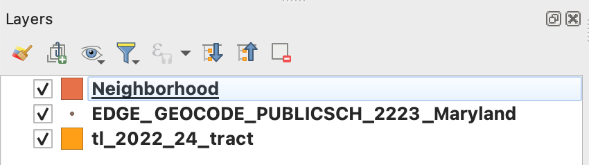  

All three of these are shapefiles, but they're different types of spatial data — `md-census-tracts` and `bmore-neighborhoods` are both polygons, and `md-public-schools` is a point type file. These are good attributes to keep tabs on, because it can help you shape your joining strategy (especially if you're trying to get things done quickly). 

## Pre-processing your files

### Make a spatial index

Because they're all shapefiles, before we get started with joins, we're going to create what's called a **spatial index** for each file. Creating a spatial index will help speed up the processing time on QGIS's end, which is a great thing for us. *(If you want to read more about what a spatial index is and why we need them, LINK TK.)*

In order to make one, we'll go to the top QGIS toolbar. Select `Vector` then `Data Management Tools` and `Create Spatial Index...` with the little gear icon. 

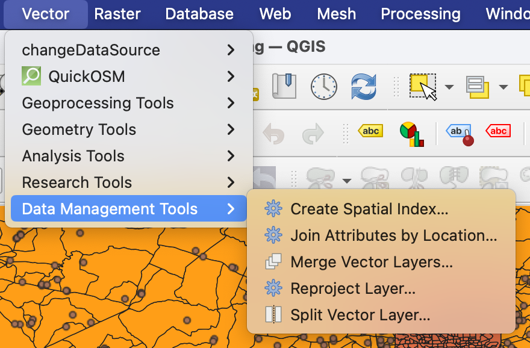 

It should open up a new window called **"Create Spatial Index"**, which is a pretty straightforward looking menu (compared to some other ones that QGIS has). The main focus is the `input layer` option, which likely has your active layer already selected. In my case, it's "`Neighborhood [EPSG:2248]`". 

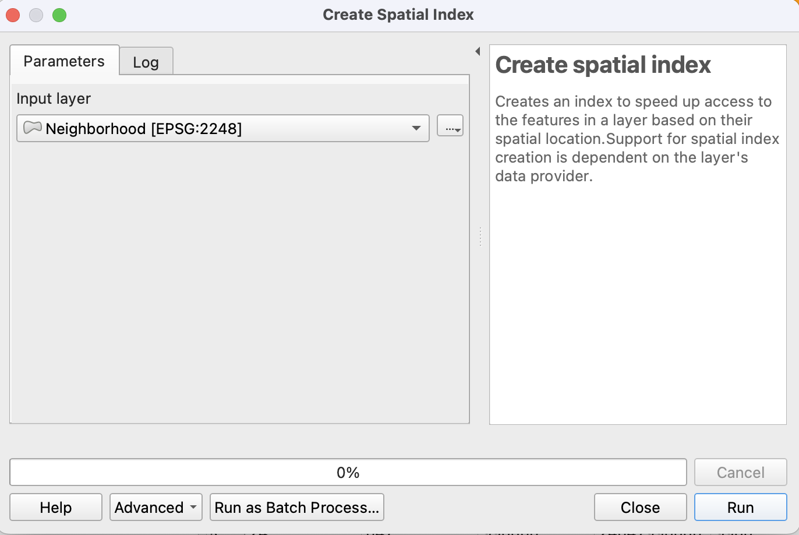

From here, all you have to do is hit **Run**. Repeat this process for the other layers to create spatial indexes for each! Nothing overt will happen — no new layers or files will be added — but trust the process. :)

### Making your layers make sense
There's no need to make working with QGIS any more confusing for yourself, so let's **rename our layers**. This won't change the file name, and it's pretty superficial, but it helps when we'll be running through spatial joins and selecting different layers as inputs. 

To change your layer names, select a layer and hit the `enter` or `return` key. Like using a code editor, it'll highlight and become editable, and you can rename the layers. Here are my recommended renaming options, though do what makes the most sense to you:
* `Neighborhood` to `bmore-neighborhoods`
* `EDGE_GEOCODE_PUBLICSCH_2223_Maryland` to `md-schools`
* `tl_2022_24_tract` to `md-tracts`

Keeping it standardized like this helps us to stay organized (and it makes the walkthrough process easier). If there's a better renaming option that you like more (like, say, renaming `Neighborhood` to `all_the_places_where_allie_and_cam_are_super_cool`), feel free to do that. 

We're also going to **add our feature count** to the layer menu. Having your feature count visible (as mentioned in the basics walkthrough) helps to gut check the data, and with spatial joins, it can help you ID whether something has gone awry.

To do that, we'll stick with the layer menu in the bottom left corner, and select all of the layers by clicking the first layer, holding shift, and clicking the last layer in the list. Then, right click, and select **Show Feature Count** toward the top of the menu:

It should make some numbers magically appear next to each of your beautifully-renamed layers, like this:

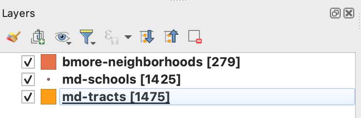

In this case, you have **279** features for `bmore-neighborhoods`, **1425** features for `md-schools`, and **1475** features for `md-tracts`. 

### Thinking through the join
In order to do the join, you've gotta _think_ like the join. You have to _be_ the join. So let's talk about what goes on when things are spatially joined together!

Typically when you do a join in SQL or Python, for example, you'll have a shared field to join against. Like if you were trying to match up a list of albums and artists with a list of songs and those artists, your data might look like this initially:

<table>
<tr>
<th>albums</th>
<th>songs</th>
</tr>
<tr>

<td>

| artist_name | album_name |
|--|--|
| Stevie Wonder | Songs In The Key of Life |
| Miles Davis | Kind of Blue |
| B-52s | Wild Planet |
| Janelle Monáe | The Age of Pleasure |
| Taylor Swift | Midnights |

</td><td>

| artist_name | song_name |
|--|--|
| B-52s | Private Idaho |
| Janelle Monáe | Float |
| Stevie Wonder | Sir Duke |
| Taylor Swift | Lavender Haze |
| Miles Davis | Blue in Green|

</td></tr> </table>

And you'd have a goal of maybe making it like this, by matching the shared field between the two datasets (which in this case is `artist_name`):
<table>
<tr>
<th>artists_music</th>
</tr>
<tr>
<td>

| artist_name | album_name | song_name |
|--|--|--|
| Stevie Wonder | Songs In The Key of Life | Sir Duke |
| Miles Davis | Kind of Blue | Blue in Green |
| B-52s | Wild Planet | Private Idaho |
| Janelle Monáe | The Age of Pleasure | Float |
| Taylor Swift | Midnights | Lavender Haze|

</td></tr> </table>

This is also a phenomenon known as a **one-to-one** join — each row has one corresponding row that gets matched. For the join to be considered **one-to-many**, your original data might look like this:

<table>
<tr>
<th>albums</th>
<th>songs</th>
</tr>
<tr>

<td>

| artist_name | album_name |
|--|--|
| Stevie Wonder | Songs In The Key of Life |
| Miles Davis | Kind of Blue |
| B-52s | Wild Planet |
| Janelle Monáe | The Age of Pleasure |
| Taylor Swift | Midnights |

</td><td>

| artist_name | song_name |
|--|--|
| B-52s | Private Idaho |
| Janelle Monáe | Float |
| Stevie Wonder | Sir Duke |
| Taylor Swift | Lavender Haze |
| Miles Davis | Blue in Green|
| Janelle Monáe | Champagne Shit |
| Taylor Swift | Karma |
| Stevie Wonder | As |
| B-52s | Give Me Back My Man |
| B-52s | Quiche Lorraine|

</td></tr> </table>

And your end result, after a join, would look something like this:

<table>
<tr>
<th>artists_music</th>
</tr>
<tr>
<td>

| artist_name | album_name | song_name |
|--|--|--|
| Stevie Wonder | Songs In The Key of Life | Sir Duke |
| Stevie Wonder | Songs In The Key of Life | As |
| Miles Davis | Kind of Blue | Blue in Green |
| B-52s | Wild Planet | Private Idaho |
| B-52s | Wild Planet | Quiche Lorraine |
| B-52s | Wild Planet | Give Me Back My Man |
| Janelle Monáe | The Age of Pleasure | Float |
| Janelle Monáe | The Age of Pleasure | Champagne Shit |
| Taylor Swift | Midnights | Lavender Haze|
| Taylor Swift | Midnights | Karma|

</td></tr> </table>

Your end result will be larger than the two datasets individually, because a **one to many** join matches values from table one and table two and adds rows for each matching value between table two and table one. (TLDR, it uses the matching field (in this case `artist_name`) from table one as an anchor, and matches up every row that has matching data (`song_name`) from table two, and duplicates all existing data in table one (`album_name`) for each row that has matching table two data.)

Again... _be_ the join. Think like the join. 

## Executing spatial joins

### _Thinking like the join_
For spatial joins, like standard joins, you'll want to think about what your end goal is. The way I do this is by thinking about my reporting question and what I'm trying to answer.

With the data we have on deck in our layer menu, we can try and work through this question ourselves. If the goal is **to create a spatial source of truth**, which has a bunch of datasets joined against each other into one mega-file, we'll probably want to do two different kinds of joins:
1. If the question is `"Which Census tracts correspond to each neighborhood in Baltimore?`", a **one to one (largest overlap)** join or a **one to many** join is probably best. In this case, our `md-tracts` layer will be our "table one" (our "`albums`" table) and our `bmore-neighborhoods` will be our "table two" (our "`songs`" table). This way, with a **one to one**, each Census tract is able to be matched up against a corresponding neighborhood boundary based on the neighborhood that has the largest overlap with. We also could do a **one to many** join, because not every Census tract neatly corresponds to a matching neighborhood boundary — sometimes one Census tract could span two or three neighborhood boundaries, for example.
2. For the question of `"What Census tracts have schools, and which schools are they?"`, we'll want to do a **one to many** join as well. Because the `md-schools` file is a point-type shapefile, it's unlikely that it'll span multiple Census tracts, but it doesn't rule out that a Census tract could have more than one school within it, which makes a one-to-many join a pretty solid choice. It'll also turn up `NULL` values for Census tracts that don't have an overlapping school, which can later be processed in a way for visualizations or othe analysis.

A special third question, which we'll really home in on and have be the basis of our "spatial source of truth":

3. For the question of `"What neighborhoods and Census tracts are Maryland schools located in?"`, we'll want to do a **one to one** join as well. For the same reason as #2, we'll be joining `bmore-neighborhoods` and (separately) `md-tracts` against `md-schools`, and because `md-schools` is a point-type file, we don't have to worry about it pulling multiple matches from the neighborhood and tract files. (*Generally.*)

This all comes down to making things **collaborative** and **cohesive** — we're often working with reporters to tackle questions they (and our readers) have about data. By breaking down spatial processing and data work into a question that we're trying to answer instead of just a task we're trying to execute, it can help us explain and work through strategies better with the larger team! 

### Navigating geometric/spatial predicates
In QGIS (and life), you'll likely encounter something called a **predicate**. A predicate is the operand that QGIS will use to process and match different data together. I always find the options to be a little confusing, so let's break them down together.

We can open the spatial join window by navigating to `Vector` > `Data Management Tools` and then `Join Attributes on Location`. 

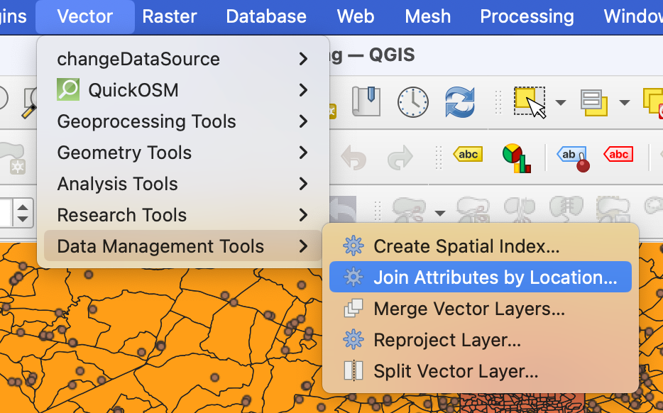

This will open the following window to allow us to create joins. You'll notice that your active layer will be the first layer mentioned in the top of the window, though you can drop down and toggle between any layers you have (so don't worry about having the layer you want selected out of the gate).

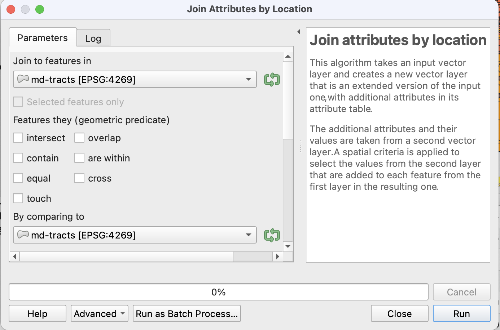

QGIS provides seven options for geometric predicates and how to spatially join data:
* intersect
* contain
* equal
* touch
* overlap
* are within
* cross

***Yes***, all of these are different and can produce very different results! Instead of reinventing the wheel, let's look at this great graphic created for a [previous version of QGIS documentation](https://docs.qgis.org/3.28/en/docs/user_manual/processing_algs/algs_include.html):

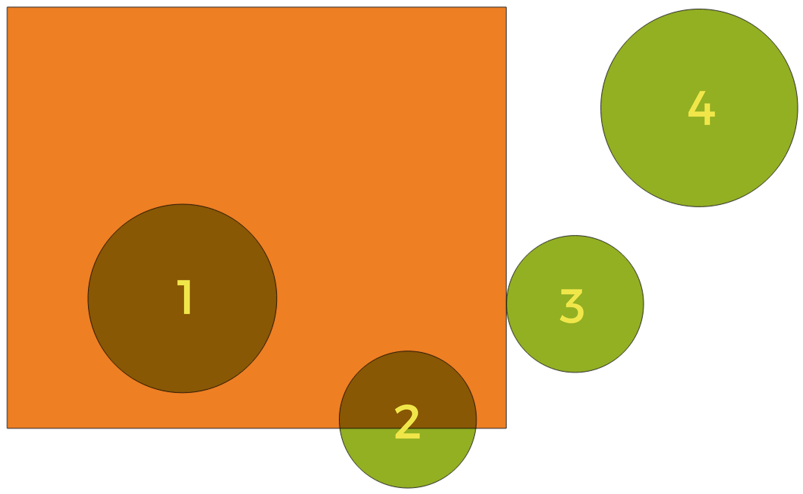

All a predicate is is a boolean operand — it runs a test, and returns yes or no, and depending on those results it either matches or doesn't match the data. 

In this case, the fine folks at QGIS broke down the shapes above like this:

    Intersect
        Tests whether a geometry intersects another. Returns 1 (true) if the geometries spatially intersect (share any portion of space - overlap or touch) and 0 if they don’t. In the picture above, this will return circles 1, 2 and 3.

    Contain
         Returns 1 (true) if and only if no points of b lie in the exterior of a, and at least one point of the interior of b lies in the interior of a. In the picture, no circle is returned, but the rectangle would be if you would look for it the other way around, as it contains circle 1 completely. This is the opposite of are within.

    Disjoint
        Returns 1 (true) if the geometries do not share any portion of space (no overlap, not touching). Only circle 4 is returned.

    Equal
         Returns 1 (true) if and only if geometries are exactly the same. No circles will be returned.

    Touch
         Tests whether a geometry touches another. Returns 1 (true) if the geometries have at least one point in common, but their interiors do not intersect. Only circle 3 is returned.

    Overlap
         Tests whether a geometry overlaps another. Returns 1 (true) if the geometries share space, are of the same dimension, but are not completely contained by each other. Only circle 2 is returned.

    Are within
        Tests whether a geometry is within another. Returns 1 (true) if geometry a is completely inside geometry b. Only circle 1 is returned.

    Cross
        Returns 1 (true) if the supplied geometries have some, but not all, interior points in common and the actual crossing is of a lower dimension than the highest supplied geometry. For example, a line crossing a polygon will cross as a line (true). Two lines crossing will cross as a point (true). Two polygons cross as a polygon (false). In the picture, no circles will be returned.

We can (and will) use these concepts to help us navigate which predicates to select for our own data. And sticking with the theme of framing things as questions, this is how I think about predicates for myself:
* intersect — "`does layer one share any space with layer two?`"
* contain — "`is layer two completely overlapped by layer one?`"
* equal = "`does layer one match layer two?`"
* touch = "`do layer one and layer two touch at all?`"
* overlap = "`do layer one and layer two share some space, but not all?`"
* are within = "`is layer one completely overlapped by layer two?`"
* cross = "`do i really genuinely like making maps?`" (kidding — "`is layer two a line, and does it intersect or touch both ends of layer one?`")

These aren't perfect by any means, but they help guide some of my decision-making. I wish I had a cool mnemonic device to share, but the truth is that with spatial data analysis, and data journalism as a whole, you don't need to have the right answers memorized — you just need to know where to find them. :) 

### Being the join!!

So let's actually get it going in QGIS, then, following the questions in order.

> #### Question one: `"Which Census tracts correspond to each neighborhood in Baltimore?"`

To answer this question, we'll join `md-tracts` against `bmore-neighborhoods`, using the method we outlined above. For predicates, we'll choose both **are within** as well as **overlap**, because we're looking for Census tracts that are entirely contained by neighborhoods, as well as tracts that may span two neighborhoods, and we want in this case, for sake of an example, a **one to many** join, which will populate the table of Census tracts with every matching neighborhood (and potentially increase our feature count if a tract has two or more matching neighborhoods). Thankfully, because we're only looking at overlap, and not whether a tract touches or intersects, we'll likely cut down on erroneous matches.

So in the **Join Attributes by Location** window, let's select `md-tracts` as our **Join to features in** input, select based on **are within** and **overlap**, and select `bmore-neighborhoods` for our **By comparing to** input. 

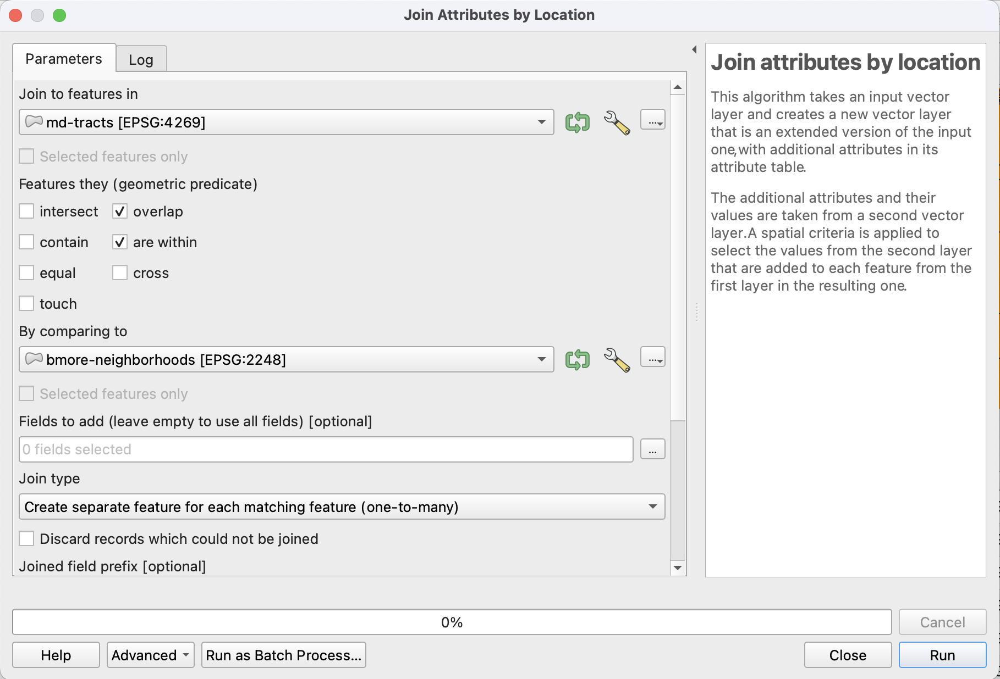

We'll also take care to select **"Create separate feature for each matching features (one-to-many)"** for our **Join type**. Then hit run!

After running, you'll get two things. One, a log of the process you just ran:

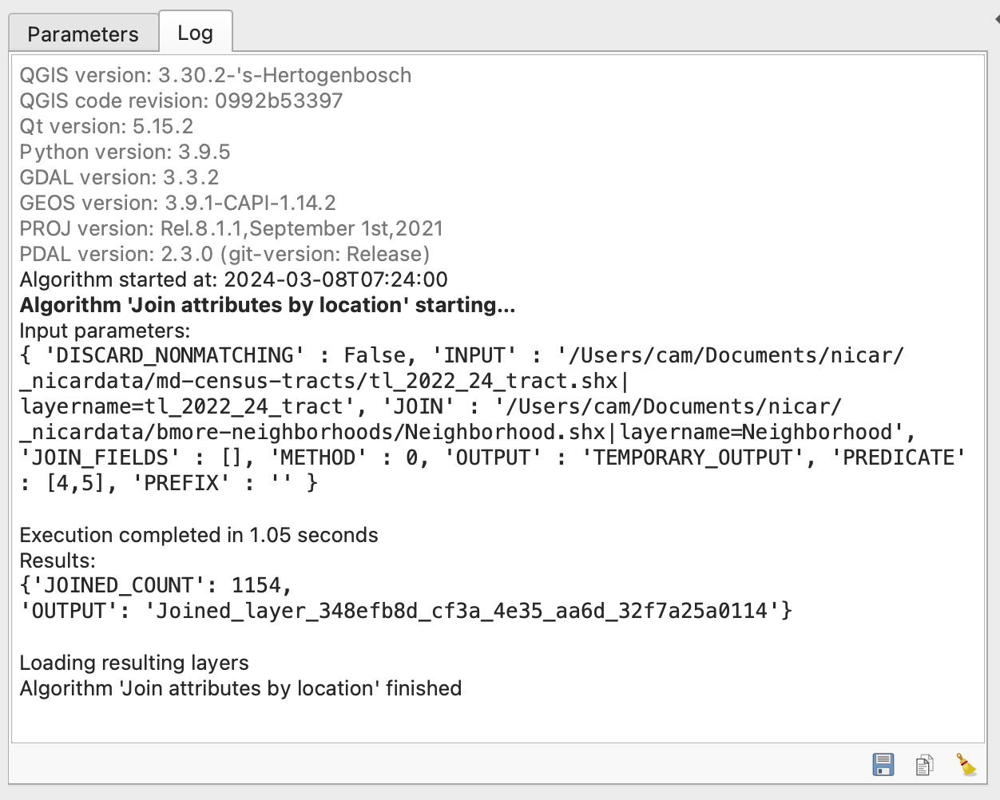

And two, a new (and in this case, pink) layer named `Joined layer`, with 2393 features.

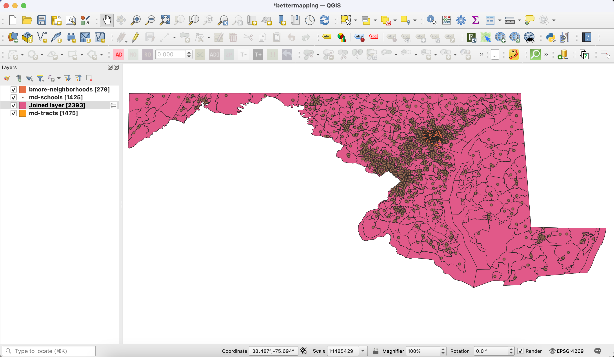

This is a layer type called a **scratch layer**, which means if QGIS crashes, it won't be saved. For the purposes of this class, feel free to just leave it as a scratch layer for now, but rename it to "**`join1`**".

One strategy I'm going to take to investigate why we have more features than we started with is to use the **Identify features** tool, which is located in the top toolbar; the icon is a cursor and information bubble. The tool will pop up a sidebar that allows you to click on features and view its attributes without having to open the attribute table, which can be a little easier to manage on the fly.

In this case, you'll see that the `bmore-neighborhoods` file had demographic data attached, and that the tract I selected (`Census tract 9608`) is pulling `NULL` values for all of them. This is because there was no match — because the `bmore-neighborhoods` file is *just* Baltimore neighborhoods.

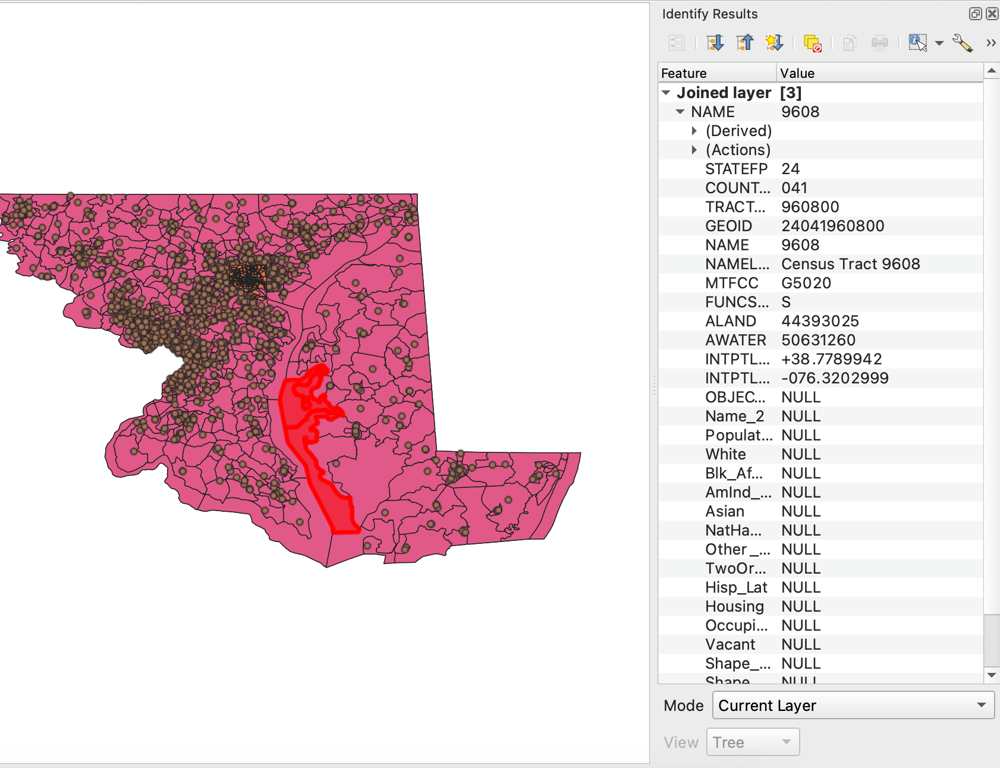

If we zoom into Baltimore and change the **symbology** of the layer to something that just shows us the outline of layer one (`md-tracts`) and layer two (`bmore-neighborhoods`), we can start to see the relationship between the two and how QGIS handles boolean operands (aka predicates).

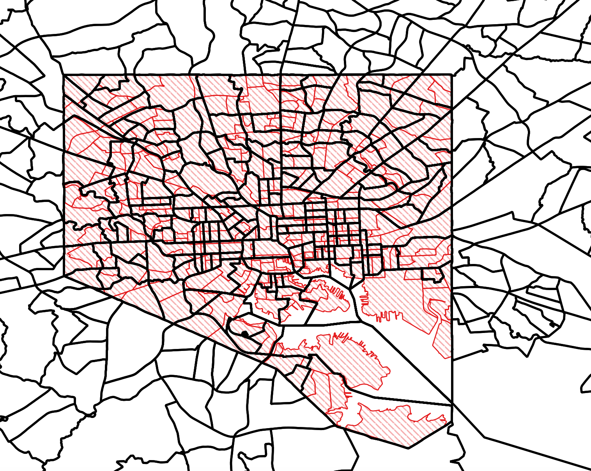

Let's zoom in a little.

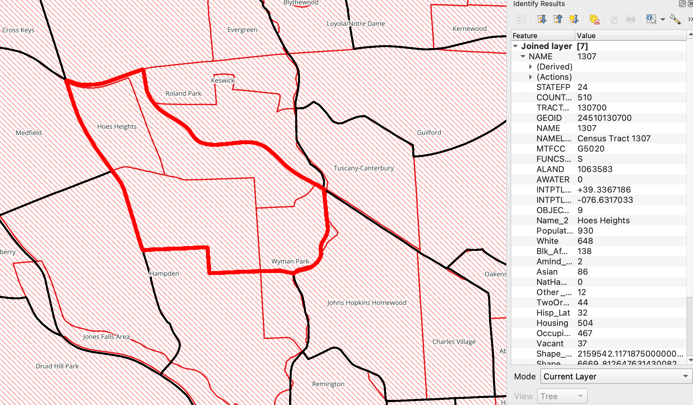

In this case, this tract (`Census tract 1307`) shares space with four (maybe five??) different neighborhoods. Let's check our attribute table to be sure, because even though it's a join, the nature of a one-to-many means the geometry will be the same, so we won't necessarily be able to tell unless we look at the data underpinning the map render.

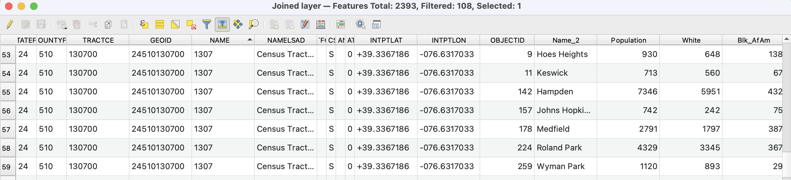

Holy mackerel! `Census tract 1307` overlaps with seven (seven!!) different neighborhoods.

> #### Question two: `"Which Census tracts have schools, and which schools are they?"`

In this case, we'll do a **one-to-many** join, keeping in mind that tracts might contain multiple schools. In this case, our first input will be `md-tracts`, our predicate will be **contain**, and our second input will be `md-schools`. 

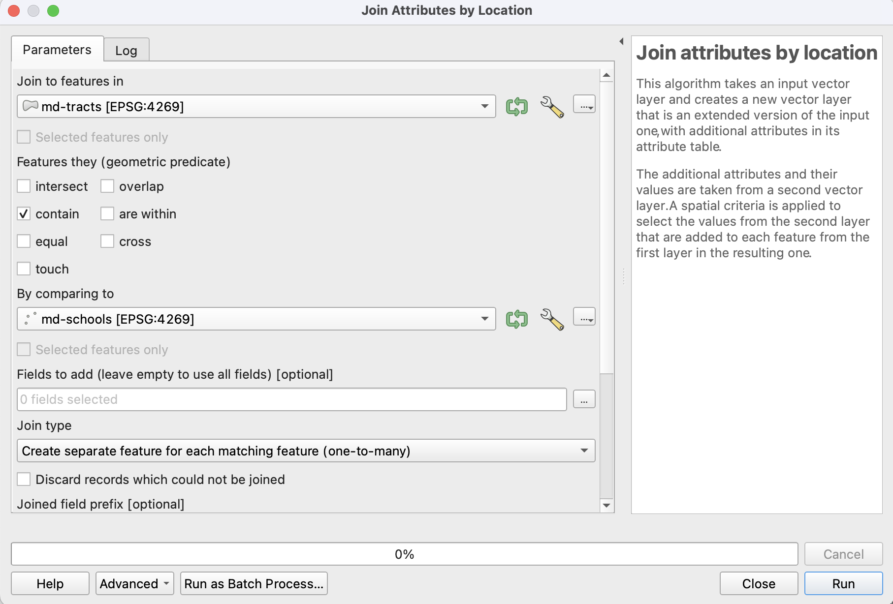

We'll be given a polygon-type file that has 2023 features, meaning our hunch was correct: some tracts do, in fact, contain multiple schools. 

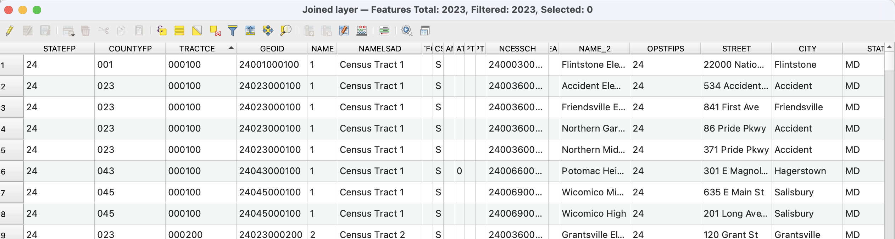

> #### Question three: `"What neighborhoods and Census tracts are Maryland schools located in?"`

For this, we'll do a **one-to-one** join, because we're looking to match up the schools (`md-schools`) against Census tracts (`md-tracts`). Because we're working with point data, we can pretty confidently select **are within** as our predicate, knowing that a single point will almost certainly be entirely within one feature. 

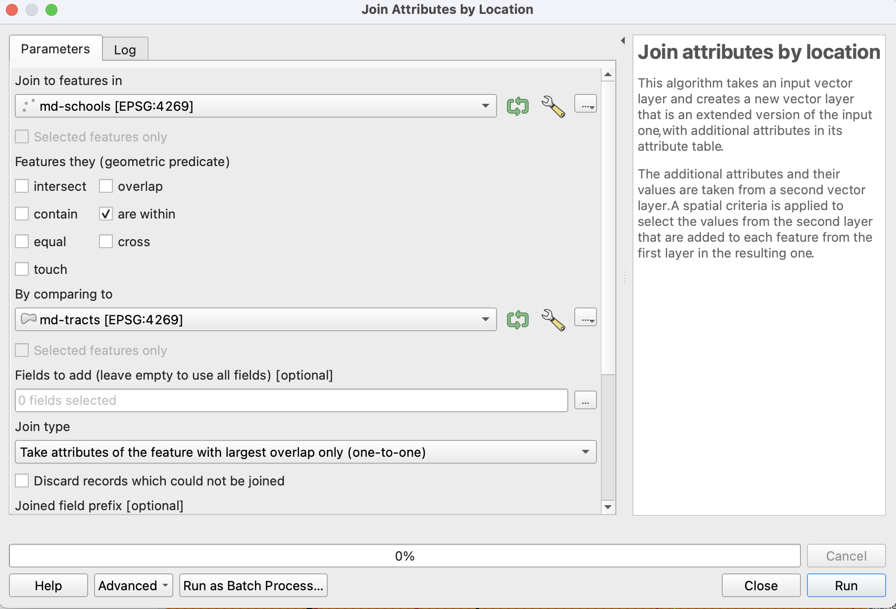

After we run this join (and name the resulting file `join3`) we'll run the spatial join *again*, this time selecting `join3` as the first input and `bmore-neighborhoods` as the second input.

Our results (which I renamed, very creatively, to "`join3-b`") will end up being a dataset that has 1425 features, the same as our `md-schools` file, because it's grouped by school name — giving us a solid platform for our next demo.

## next walkthrough: [creating buffers, clusters and counts, oh my!](./qgis-buffers.md)