Hi! If you’re reading this, it’s probably because you took or were interested in taking the class “Make Mapping Better!” at NICAR 2024, starring Allie Kanik (Hearst) and Cam Rodriguez (BGA/Illinois Answers Project). 

The way this QGIS walkthrough will be structured will be in a few parts: 
* Creating cohesive workflows
* Making those workflows collaborative
* Being able to repeat them in the future

Working with spatial data in a newsroom environment can be tricky — especially if you're a small (or solo!) data and/or dev team. Reporters have questions about the data that you need to explain, editors need something to look at in a way that makes sense to them, and that's on top of making sure your data is bulletproof, not garbled, and that a month from now (or tomorrow) you'll remember what you did and why. 

For this class, we're using a mix of QGIS and Python workflows to illustrate a few spatial concepts, and (how in some cases) they can be made better. (*And while "better" is subjective, it'll at least hit at those three key ideas: cohesion, collaboration, and repetition.*) We've chosen these two strategies (QGIS and Python) because they're essentially one and the same: QGIS is a more visual interface for spatial data that runs on Python, with a lot of overlapping concepts by design!

Our basics walkthrough is below, but the other QGIS walkthroughs are in this repo:
* A [demo and explainer of spatial joins](./qgis-spatial-joins.md)
* A [quick demo of building buffers](./qgis-buffers.md)
* 

# A basic primer of QGIS

So let's find our way around QGIS! (If you're following along at home, you can download the latest version or LTR of QGIS here: )

Once you open QGIS, you'll be met with an interface like this:
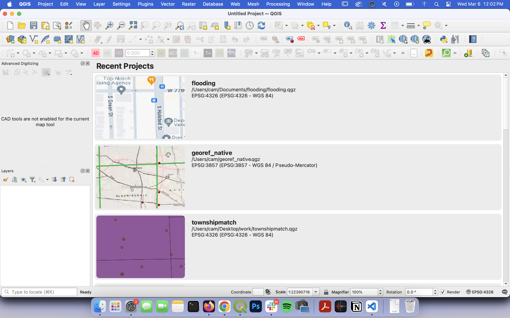

*(Note that I'm running QGIS version 3.30.2, which in turn is running Python 3.9.5, GDAL/OGR 3.3.2, and SQLite 3.35.2. You don't necessarily need to know all of this — the important thing to note is that I'm also running this on a Mac, but rest assured that the layout and mechanics are the same on PC. TK:raised hands:)*

## Starting a new project

We'll start by opening a new project file in the top left corner by clicking the white sheet of paper. Let's name it something straightforward... maybe "bettermapping", and we'll save it within the repo (which has the file path ./[PATHTK]) by clicking the floppy disk.

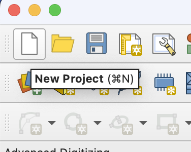
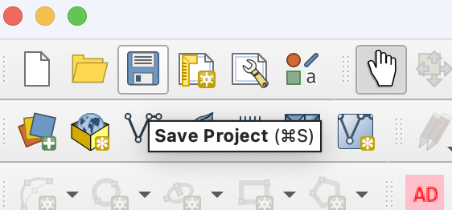

Best practice is to keep everything in one place. QGIS projects are often saved across multiple files, so if you're missing files, it could cause the project to not open properly, or at all. This is usually a sticking point for why spatial data can be so challenging to work with collaboratively, though we'll get to that in a bit!

## Importing files into QGIS

But in order to have a project going, you have to have data, and importing it is the first step. The import process is housed in the **Layer** menu, which can be found at the top toolbar in between "View" and "Settings."

For the purposes of this class, we've made the layer data in advance, so hover over the menu and select **"Add Layer"**. 

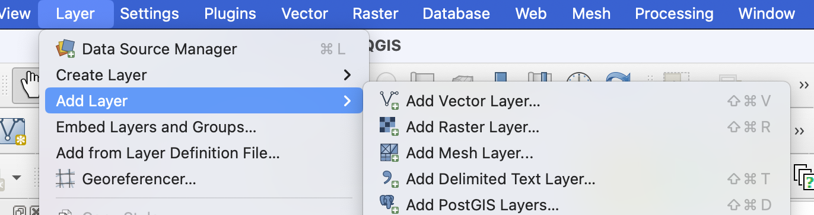

The two options in this menu that'll probably be the most heavily used for you on a day-to-day basis will be **"Add Vector Layer"** and **"Add Delimited Text Layer"**. We'll be using both in these demos for QGIS! For now, select **"Add Vector Layer"**. A separate window should pop up.

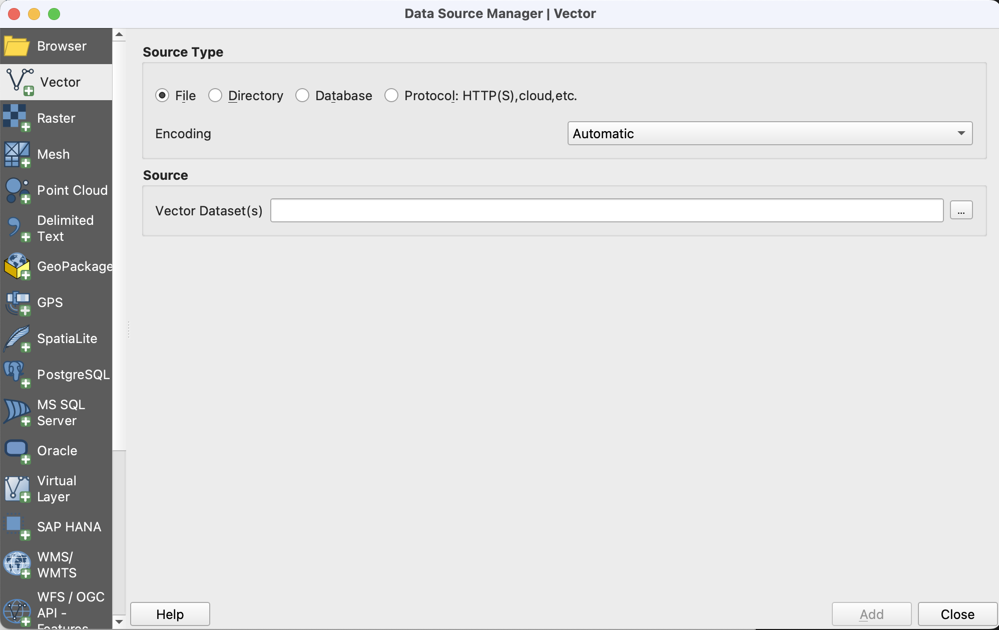

From here, click the three dots next to "Vector Dataset(s)" and select into the repo folder with the data — `data`. Select the folder named ``md-census-tracts``.

The data contained by the folder `md-census-tracts` is something called a **shapefile** — it's a type of spatial dataset that a company called ESRI spun up many moons ago. Shapefiles consist of multiple different files (you can read a breakdown of what goes into a shapefile here TK), so in order to import this into QGIS, we're going to need to select all of the files in that folder (you can select all using `ctrl+a` or `cmd+a`, or clicking the first file + holding shift and clicking the last file in the list), then hit **"open"**.

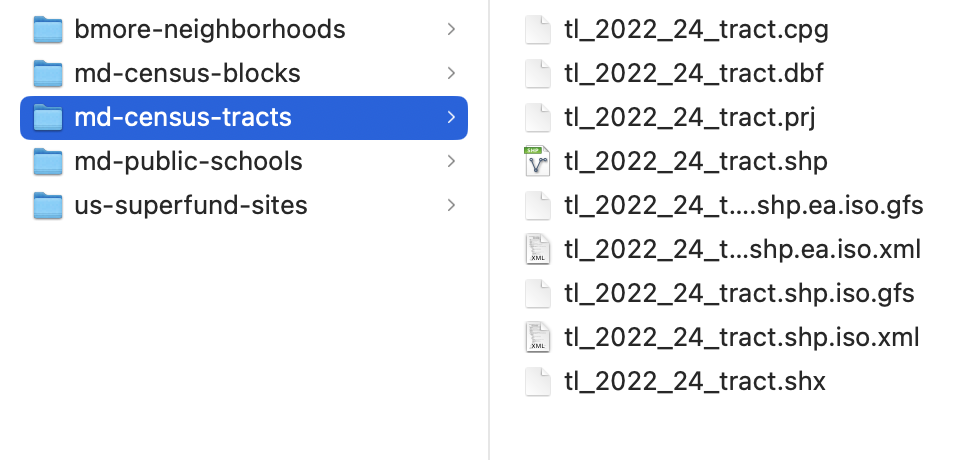 

You'll likely get a pop-up saying that the project CRS is different than the file's CRS — don't freak out! A CRS (coordinate TK system) is the way that the computer knows where the geometry is in an geographic plane. The most common CRS-es to use are **WGS84** and **NAD83**; for web-mapping, **WGS84** (*also* known as **EPSG4269**) is typically the default.

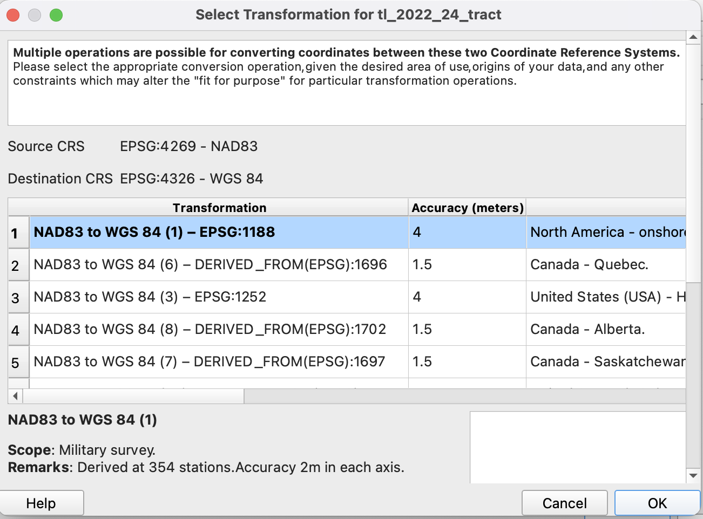

In most cases, picking the first option that they present is perfectly fine. So we'll do that! Click the first option (`NAD83 to WGS84 (1) — EPSG:1188`) and hit **OK**.

You should see the great state of Maryland show up on your screen, with the **Layers** menu box on the bottom left fill up with a bunch of file names.

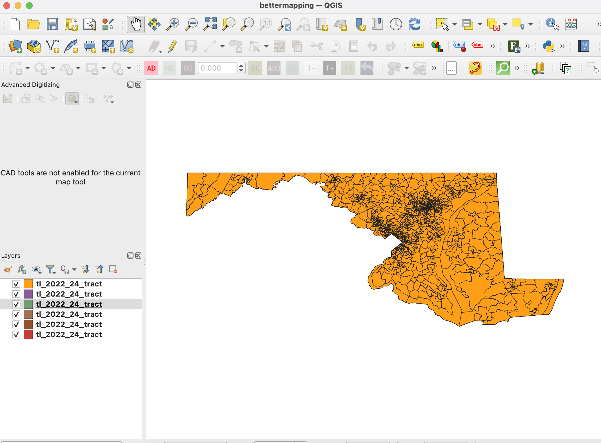

You can ignore the *majority* of these file names. In fact, feel free to delete them, if you'd like! Sometimes, imports of shapefiles can lead to a glut of layers because of (LINK TK) how spatial datasets are processed and packaged.

## Understanding the attribute table
An **attribute table** shows all of the data in a tabular format for each feature. At bare minimum, this typically includes an ID or some sort of identifier, as well as sometimes things not unique to spatial data (like statistics or demographic information, etc) and things that *tend to be* unique (like latitude and longitude, polygon areas, standardized IDs (like FIPS codes) and multi-point data). 

In QGIS, you can find the attribute table in a few places. (Ignoring all of my plugins, it's typically in the top row!) Either way, it looks like this in the toolbar:

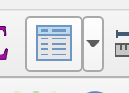

When selecting the attribute table from up top, it'll pull the table for the active layer you've selected in the bottom left corner **Layer** menu.

Speaking of which — another place you can open the attribute table is by clicking the layer names themselves. **If you right click a layer name, you'll get these options**:

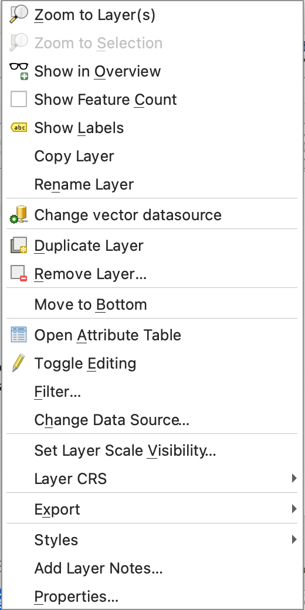

We'll talk about some of these later, but for now, you can hit **Open Attribute Table** and be able to access the table that way as well.

So what does it look like? This!

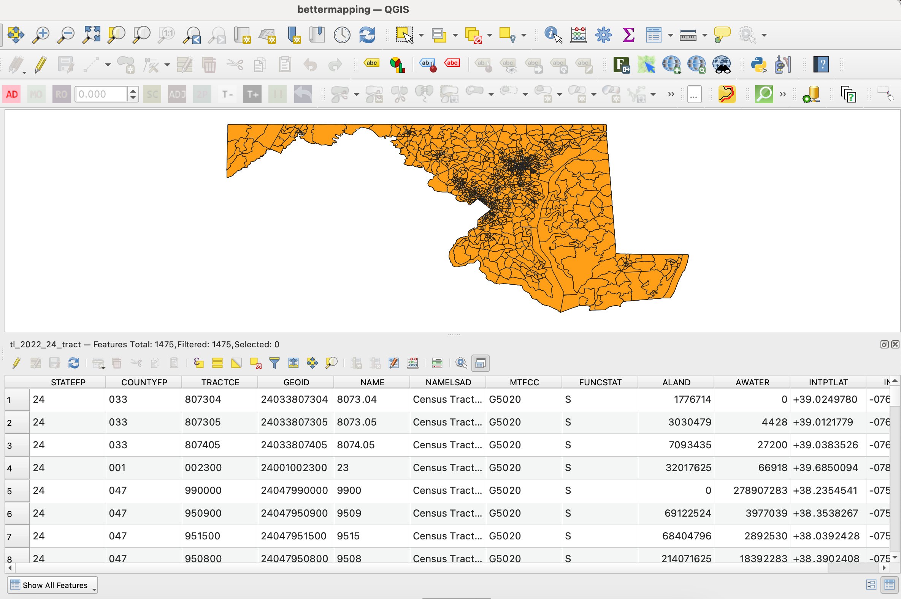

At the top, you'll notice the name of the layer the table is pulling data for, as well as the **number of features**. Knowing how many features are in a layer can be super helpful, because it can help with QA/QC of a process, particularly for joins.

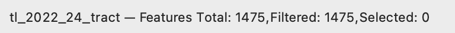

Depending on your settings, the attribute table might pop up as a separate window. If you'd like (which for the purposes of this class, you might want to), you can dock the attribute table to the bottom of your window by selecting this option:

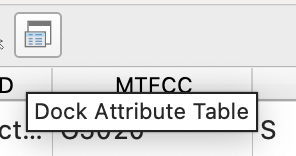

The attribute table is a super helpful tool to help crunch numbers, identify features and (important!) spatially or non-spatially join new data. The data we're working with is from the Census Bureau (LINK TK), who fills their data with a bunch of helpful identifiers to be able to join against and visualize in the future, including: 
* `STATEFP` (the FIPS code for Maryland)
* `COUNTYFP` (the FIPS code for different MD counties)
* `GEOID` (a unique code LINK TK from the Census)
* `NAMELSAD` (a written out name of each feature, helpful for visualization or labels if needed)

This also is helpful for (drumroll please)...

## Selecting features
Because we have the attribute table open, we'll start with selecting features from the table. Click the `1` row number in the attribute table to select the entire row (like you would in Excel or Google Sheets). The row should appear to be blue, and the first value will be highlighted green as well:

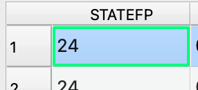

We know that a feature is selected because the attribute table will tell us in the window name like before, similar to when Excel or Sheets will tell you if you have rows filtered:

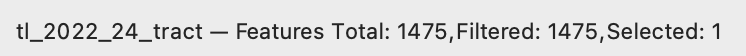

We can also tell by the map itself! Let's look at the layer rendering above the attribute table. When features are selected in QGIS, they're typically highlighted a super bright yellow, but in this case, there's no yellow Census tract to be found. Thankfully, QGIS has thought of that, so we'll hit the **"Zoom to selected"** option in the attribute table window's toolbar, right above our highlighted row.

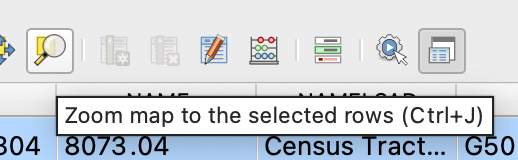

*You can also use the shortcut `ctrl+j`, as it tells you!*

When we do that, it pulls us straight to Census Tract 8073.04, the one we selected, which is *super* brightly colored because of the highlight. We can zoom in and out to get a sense of place, which is also very helpful to get your bearings with an unfamiliar place. 

To deselect the Census Tract, we'll go back to the attribute toolbar and hit the button that has a tiny red icon near the zoom tool. This will remove our selection (and the highlight), and, because you can highlight more than one feature in a given layer, it'll remove any selections from your active layer that you're working in.

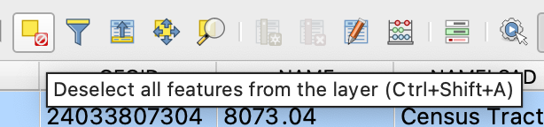

This is all we need to know for _now_; we'll get to more details in a few. The other big main data tenet applies **HEAVILY** to QGIS: **save early and often**. 

## next walkthrough: [creating spatial joins](./qgis-spatial-joins.md)